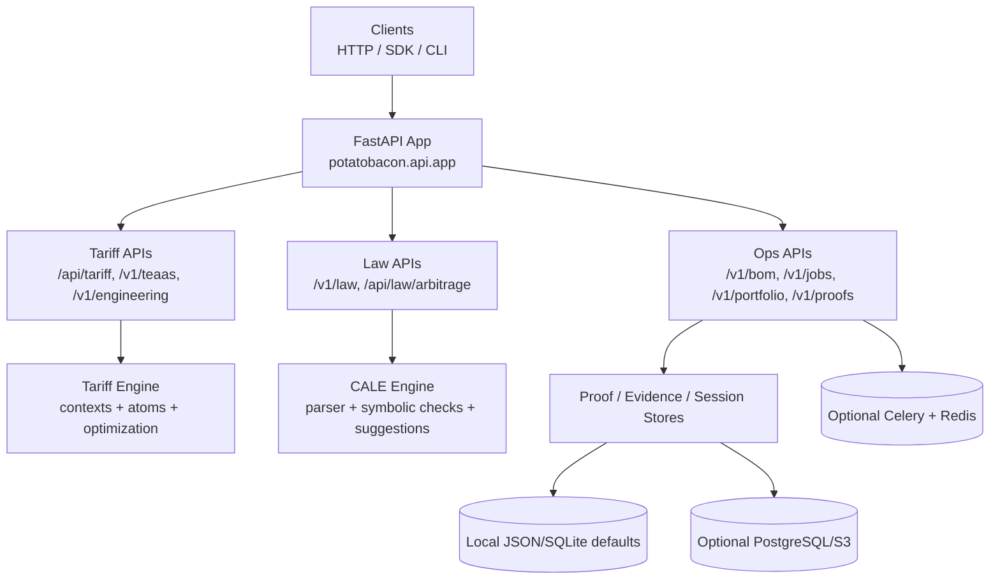

# potato-to-bacon

**A FastAPI platform for tariff engineering and legal-rule analysis, combining HTS classification, duty optimization, and auditable proof generation.**

---

## Overview

`potato-to-bacon` is a multi-domain decision engine centered on two primary workflows:

- **TEaaS (Tariff Engineering-as-a-Service):** Analyze SKUs/BOMs, classify duty exposure, simulate optimization mutations, and persist proof-backed results.
- **CALE (Context-Aware Legal Engine):** Parse legal rules, detect policy conflicts, suggest amendments, and run arbitrage-style scenario analysis.

The repository also contains legacy physics/DSL assets from earlier iterations, but the actively wired production surface is the **FastAPI service under `potatobacon.api.app`** plus tariff/law engines.

---

## Key Features

- **Tariff analysis and optimization APIs** for baseline vs. optimized duty outcomes (`/api/tariff/*`, `/v1/teaas/*`, `/v1/engineering/*`).
- **BOM ingestion pipeline** with upload, asynchronous analysis jobs, and result retrieval (`/v1/bom/*`, `/v1/jobs/*`).
- **Law-context management** for versioned context manifests and atom loading (`/v1/law-contexts/*`).
- **Cryptographic-style proof retrieval** and evidence payload access (`/v1/proofs/*`, plus tariff audit-pack PDF endpoint).
- **Tenant-aware API key model** with per-route rate limiting and plan metadata (`/v1/auth/whoami`).
- **Optional production backends**: PostgreSQL, Redis, Celery, and S3 via feature flags.
- **Portfolio endpoints** for aggregate duty visibility, SKU listing, and schedule alerts (`/v1/portfolio/*`).

---

## Architecture



### Runtime model

- The app boots CALE services in FastAPI lifespan hooks.
- Routers are mounted from domain-focused modules under `src/potatobacon/api/`.
- Default development persistence uses local files/SQLite-style stores under `data/`.
- Production-oriented paths are gated by environment flags (`PTB_STORAGE_BACKEND`, `PTB_JOB_BACKEND`, `PTB_EVIDENCE_BACKEND`).

---

## Repository Structure

```text
.
├── src/potatobacon/api/        # FastAPI app + route modules
├── src/potatobacon/tariff/     # Tariff engine, HTS context handling, optimization logic
├── src/potatobacon/cale/       # CALE legal parsing, symbolic reasoning, scoring
├── src/potatobacon/law/        # Law ingestion, jobs, arbitrage logic
├── src/potatobacon/proofs/     # Proof serialization/storage logic
├── src/potatobacon/db/         # SQLAlchemy models + session management
├── src/potatobacon/workers/    # Celery app/tasks (optional async backend)
├── alembic/                    # Database migrations
├── data/                       # Contexts, overlays, benchmarks, local persistence artifacts
├── tests/                      # Unit/integration/system tests
├── scripts/                    # Utility and benchmark runners
├── tools/                      # Data acquisition/evaluation tooling
├── web/                        # Static web UI assets (served under /ui when present in /app/web)
└── docs/                       # Additional project notes and guides
```

---

## Tech Stack

| Category | Stack |
|---|---|
| Language | Python 3.11+ |
| API Framework | FastAPI, Uvicorn, Pydantic v2 |
| Solvers / Core Compute | z3-solver, NumPy, pandas, scikit-learn, NetworkX |
| Persistence (default) | Local JSON/JSONL + SQLite-style local store files |
| Persistence (optional) | PostgreSQL (SQLAlchemy + Alembic), S3 (boto3) |
| Async / Queue (optional) | Celery + Redis |
| Security | API-key auth + in-process rate limiting |
| Testing | pytest, hypothesis, pytest-cov |
| Packaging / Tooling | setuptools (`pyproject.toml`), Black, Ruff, mypy, Make |
| Deployment Artifacts | Dockerfile, Procfile, Railway config backup |

---

## Getting Started

### Prerequisites

- Python **3.11+**
- `pip`

### Installation

```bash
python -m venv .venv
source .venv/bin/activate
pip install -e .
```

For development/test tooling:

```bash
pip install -e ".[dev,tests]"
```

### Run locally

```bash
make run
# or
uvicorn potatobacon.api.app:app --host 0.0.0.0 --port 8000
```

API docs are available at:

- `http://localhost:8000/docs`
- `http://localhost:8000/openapi.json`

> Most routed APIs require `X-API-Key`. If no keys are configured, the service falls back to a development key behavior in code paths.

---

## Usage

### 1) Health + service metadata

```bash
curl -s http://localhost:8000/v1/health
curl -s http://localhost:8000/v1/info
```

### 2) Tariff optimization example

```bash
curl -s -X POST http://localhost:8000/api/tariff/optimize \
  -H "Content-Type: application/json" \
  -H "X-API-Key: dev-key" \
  -d '{
    "scenario": {
      "upper_material_textile": true,
      "outer_sole_material_rubber_or_plastics": true,
      "surface_contact_rubber_gt_50": true,
      "surface_contact_textile_gt_50": false,
      "felt_covering_gt_50": false
    },
    "candidate_mutations": {
      "felt_covering_gt_50": [false, true]
    },
    "declared_value_per_unit": 100.0,
    "annual_volume": 10000
  }'
```

### 3) TEaaS single-request workflow

```bash
curl -s -X POST http://localhost:8000/v1/teaas/analyze \
  -H "Content-Type: application/json" \
  -H "X-API-Key: dev-key" \
  -d '{
    "description": "Women\'s textile upper footwear with rubber outer sole",
    "origin_country": "CN",
    "import_country": "US",
    "declared_value_per_unit": 45.0,
    "annual_volume": 25000,
    "max_mutations": 10
  }'
```

### 4) Rule conflict analysis

```bash
curl -s -X POST http://localhost:8000/v1/law/analyze \
  -H "Content-Type: application/json" \
  -H "X-API-Key: dev-key" \
  -d '{
    "rule1": {
      "text": "Organizations MUST collect personal data IF consent.",
      "jurisdiction": "Canada.Federal",
      "statute": "PIPEDA",
      "section": "7(3)",
      "enactment_year": 2000
    },
    "rule2": {
      "text": "Security agencies MUST NOT collect personal data IF emergency.",
      "jurisdiction": "Canada.Federal",
      "statute": "Anti-Terrorism Act",
      "section": "83.28",
      "enactment_year": 2001
    }
  }'
```

### 5) CLI sanity check (law)

```bash
ptb law sanity-check --emit-precedents --emit-confidence
```

---

## Configuration

The service is heavily environment-driven. Key variables used in code:

### Core runtime

- `CALE_API_KEYS` — comma-separated API keys.
- `CALE_RATE_LIMIT_PER_MINUTE` — per-key per-route limiter.
- `CALE_RATE_WINDOW_SEC` — rate limit window.
- `CALE_ENGINE_VERSION` — version metadata returned by version endpoint.
- `GIT_COMMIT` — optional build SHA in info/version responses.

### Storage and state

- `PTB_DATA_ROOT` — base directory for tenant/SKU/evidence local stores.
- `PTB_STORAGE_BACKEND` — `jsonl` (default) or `postgres`.
- `PTB_EVIDENCE_BACKEND` — `local` (default) or `s3`.
- `CALE_STORAGE_PATH` — persistence DB path for arbitrage assets.
- `PTB_PDF_CACHE_DIR` — output/cache path for generated PDFs.

### Async + distributed services

- `PTB_JOB_BACKEND` — `threads` (default) or `celery`.
- `PTB_REDIS_CACHE` / `REDIS_URL` — Redis-backed solver caching toggles.
- `CELERY_BROKER_URL`, `CELERY_RESULT_BACKEND` — Celery runtime.
- `DATABASE_URL` — PostgreSQL connection string.

### S3 backend

- `S3_BUCKET`, `AWS_REGION`
- `AWS_ACCESS_KEY_ID`, `AWS_SECRET_ACCESS_KEY`

---

## Development

### Common commands

```bash
make fmt        # black + ruff --fix
make lint       # ruff + black --check
make type       # mypy src
make test       # pytest -q
make run        # uvicorn app
```

### Alternate test runner

```bash
python scripts/run_tests.py
```

This script auto-enables coverage flags when `pytest-cov` is available.

---

## Testing

- Tests are organized under `tests/` with API, system, finance, proof, SDK, and validation suites.
- CI workflows run pytest on Python 3.11.
- Additional scheduled validation workflow runs real-world SEC-oriented evaluation tooling.

---

## Deployment

### Docker

```bash
docker build -t potatobacon:dev .
docker run -p 8000:8000 potatobacon:dev
```

### Procfile / platform deploy

- `Procfile` runs `uvicorn potatobacon.api.app:app`.
- `railway.json.bak` documents a Railway-oriented start command and healthcheck path.

### Database migrations

When using PostgreSQL backend:

```bash
alembic upgrade head
```

---

## Security & Limitations

- Authentication is API-key based; ensure production keys are rotated and stored securely.
- Default CORS policy currently allows all origins/methods/headers.
- Several modules indicate active transition from in-memory/local stores to production services; behavior can differ by selected backend flags.
- The repository includes legacy modules and tests from prior product direction; not every historical path is wired into the current FastAPI surface.

---

## Contributing

1. Create a feature branch.
2. Install dev dependencies: `pip install -e ".[dev,tests]"`.
3. Run formatting, linting, and tests.
4. Submit a PR with clear scope, validation notes, and API-impact summary when applicable.

---

## License

This project is licensed under the **MIT License**. See [`LICENSE`](LICENSE).

